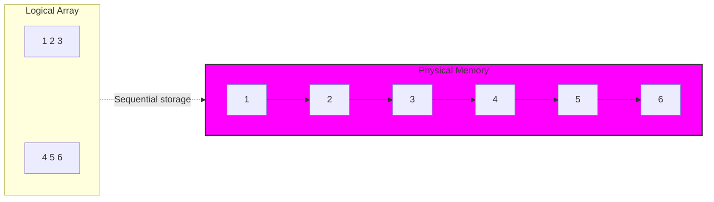
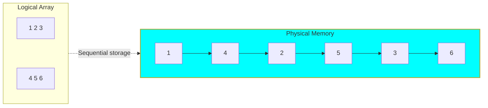

# Matrix Calculate
## General
- This is the learning note with a sample code snippet
- This note has the matrix calculate method and optimizing the matrix calculate for the CUDA GPU programming

## Contents
### Basic matrix calculate
#### Define general matrix
```math
\mathbf{A} = 
\begin{pmatrix}
a_{11} & a_{12} & a_{13} \\
a_{21} & a_{22} & a_{23} \\
a_{31} & a_{32} & a_{33} \\
\end{pmatrix}
\\[12px]

\mathbf{B} = 
\begin{pmatrix}
b_{11} & b_{12} & b_{13} \\
b_{21} & b_{22} & b_{23} \\
b_{31} & b_{32} & b_{33} \\
\end{pmatrix}
\\[12px]

\mathbf{C} = 
\begin{pmatrix}
c_{11} & c_{12} & c_{13} \\
c_{21} & c_{22} & c_{23} \\
c_{31} & c_{32} & c_{33} \\
\end{pmatrix}
```

#### Plus and Minus Calculate
```math
\mathbf{C} = \mathbf{A} \pm \mathbf{B} \quad
\\[12px]
\iff
\\[12px]
\begin{pmatrix}
c_{11} & c_{12} & c_{13} \\
c_{21} & c_{22} & c_{23} \\
c_{31} & c_{32} & c_{33} \\
\end{pmatrix}
=
\begin{pmatrix}
a_{11} & a_{12} & a_{13} \\
a_{21} & a_{22} & a_{23} \\
a_{31} & a_{32} & a_{33} \\
\end{pmatrix}
\pm
\begin{pmatrix}
b_{11} & b_{12} & b_{13} \\
b_{21} & b_{22} & b_{23} \\
b_{31} & b_{32} & b_{33} \\
\end{pmatrix}
\\[12px]
\iff
\\[12px]
\begin{pmatrix}
c_{11} & c_{12} & c_{13} \\
c_{21} & c_{22} & c_{23} \\
c_{31} & c_{32} & c_{33} \\
\end{pmatrix}
=
\begin{pmatrix}
a_{11} \pm b_{11} & a_{12} \pm b_{12} & a_{13} \pm b_{13} \\
a_{21} \pm b_{21} & a_{22} \pm b_{22} & a_{23} \pm b_{23} \\
a_{31} \pm b_{31} & a_{32} \pm b_{32} & a_{33} \pm b_{33} \\
\end{pmatrix}
```
#### Multiple Calculate
```math
\mathbf{C} = \mathbf{A} \cdot \mathbf{B} \quad
\\[12px]
\iff
\\[12px]
\begin{pmatrix}
c_{11} & c_{12} & c_{13} \\
c_{21} & c_{22} & c_{23} \\
c_{31} & c_{32} & c_{33} \\
\end{pmatrix}
=
\begin{pmatrix}
a_{11} & a_{12} & a_{13} \\
a_{21} & a_{22} & a_{23} \\
a_{31} & a_{32} & a_{33} \\
\end{pmatrix}
\cdot
\begin{pmatrix}
b_{11} & b_{12} & b_{13} \\
b_{21} & b_{22} & b_{23} \\
b_{31} & b_{32} & b_{33} \\
\end{pmatrix}
\\[12px]
\iff
\\[12px]
\begin{pmatrix}
c_{11} & c_{12} & c_{13} \\
c_{21} & c_{22} & c_{23} \\
c_{31} & c_{32} & c_{33} \\
\end{pmatrix}
=
\begin{pmatrix}
a_{11} \times b_{11} + a_{12} \times b_{21} + a_{13} \times b_{31} & a_{11} \times b_{12} + a_{12} \times b_{22} + a_{13} \times b_{32} & a_{11} \times b_{13} + a_{12} \times b_{23} + a_{13} \times b_{33} \\
a_{21} \times b_{11} + a_{22} \times b_{21} + a_{23} \times b_{31} & a_{21} \times b_{12} + a_{22} \times b_{12} + a_{23} \times b_{32} & a_{21} \times b_{13} + a_{22} \times b_{23} + a_{3} \times b_{33} & \\
a_{31} \times b_{11} + a_{32} \times b_{21} + a_{33} \times b_{31} & a_{31} \times b_{12} + a_{32} \times b_{12} + a_{33} \times b_{32} & a_{31} \times b_{13} + a_{32} \times b_{23} + a_{33} \times b_{33} \\
\end{pmatrix}
```

### The Difference of CPU Memory Major bitween CUDA and Language C
#### 1. Language C and Other Prgraming Language (*C, C++, Python, Java*)

- Sample Matrix Define
$$
\begin{pmatrix}
1 & 2 & 3 \\
4 & 5 & 6 
\end{pmatrix}
$$

It is scanned **horizontally** and spaced in memory.


#### 2. CUDA (*Fortran, MATLAB, R, Julia*)
- Sample Matirx Define

$$
\begin{pmatrix}
1 & 2 & 3 \\
4 & 5 & 6 
\end{pmatrix}
$$

It is scanned **vertically** and placed in memory.
